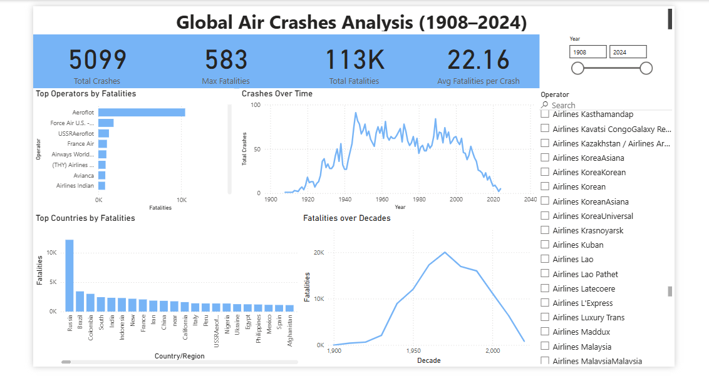
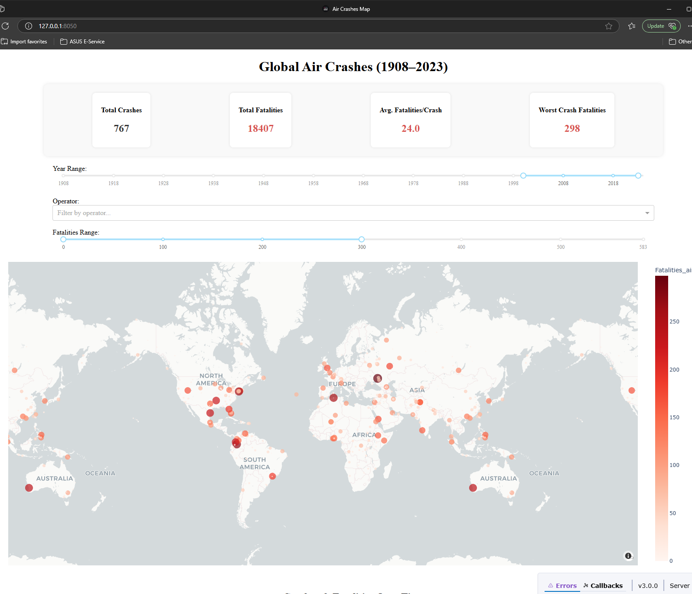

# Global Air Crashes Analysis (1908–2023)

This data-driven project analyzes more than 5,000 air crashes from 1908 to 2023, providing deep insights into aviation accidents. It features:

  
- A Power BI dashboard offering clean, professional visual analytics  
- A Python-powered Dash web application with an interactive map and dynamic charts   URL : https://youneselaoufy.com/aircrashes/
- Robust data cleaning and geolocation enrichment using OpenStreetMap API

---

## Power BI Dashboard

The Power BI version provides a compact executive summary with:

- KPI Cards: Total crashes, total fatalities, average fatalities per crash
- Charts:  
  - Crashes over time  
  - Top operators by fatalities  
  - Fatalities by country  
  - Fatalities by decade
- Interactive slicers for year and operator




Location of files:

- Dashboard: `reports/power_bi/air_crashes_dashboard.pbix`
- Preview image: `reports/power_bi/aircrashes_powerbi_dashboard.png`

---

## Dash Web App
https://youneselaoufy.com/aircrashes/


Built using Dash, Plotly, Flask, and Pandas, the web app includes:


- The Dash-based web app offers an interactive way to explore air crash data globally. Built with Dash, Plotly, Flask, and Pandas, it includes:

- Interactive Map of Crashes
Displays crash locations on a world map, colored and sized by number of fatalities. Hover tooltips show crash details.

- Filter Controls
Users can dynamically filter data by:

Year range (slider)

Operator (multi-select dropdown)

Fatalities range (slider)

- KPI Summary Cards
Real-time metrics showing:

Total crashes

Total fatalities

Average fatalities per crash

Max fatalities (deadliest crash)

- Yearly Trends Chart
A line chart showing yearly trends for crashes and fatalities.

- Country-Level Choropleth Map
Heatmap of crashes aggregated by country.

- Recent Crashes Table
Displays the most recent 20 crashes with operator, aircraft, location, date, and fatalities.


To run locally:

```bash
cd webapp
python app.py
```

---


---

## Project Structure

```
air-crashes-analysis/
│
├── data/
│   ├── raw/                         
│   └── processed/                   
│       └── cleaned_aircrashes_with_geo.csv
│
├── notebooks/
│   └── air_crashes_analysis.ipynb  
│
├── reports/
│   ├── figures/                     
│   └── power_bi/
│       ├── air_crashes_dashboard.pbix
│       └── aircrashes_powerbi_dashboard.png
│
├── src/
│   ├── data_cleaning.py            
│   ├── geolocation_cachefile.csv   
│   ├── visualization.py            
│
└── webapp/
    └── app.py                      
```

---

## Dataset

- Source: [Kaggle Air Crashes Full Data (1908–2023)](https://www.kaggle.com/datasets/jogwums/air-crashes-full-data-1908-2023)

---

## Key Features

- Cleaned over 5,000 records with null handling and formatting
- Enriched dataset with latitude and longitude via OpenStreetMap API
- Insightful dashboards in Power BI and Dash
- Clear storytelling with focus on crashes, impact, and evolution over time

---

## How to Run the Project

1. Clone the repository:

```bash
git clone https://github.com/youneselaoufy/air-crashes-analysis.git
cd air-crashes-analysis
```

2. Install dependencies:

```bash
pip install -r requirements.txt
```

3. Run the cleaning script:

```bash
python src/data_cleaning.py
```

4. Run visualizations:

```bash
python src/visualization.py
```

5. Launch the Dash web app:

```bash
cd webapp
python app.py
```

---

## Optional Enhancements

- Deploy Dash app on Render or Heroku
- Link Power BI dashboard to a live SQL backend
- Add time-based filtering to the interactive map
- Implement machine learning crash prediction (experimental)
